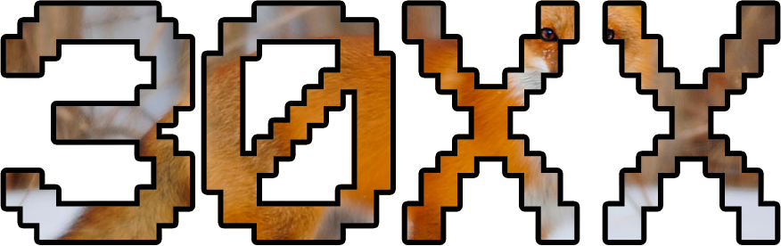

# 30XX Remake

The year is 30XX. The world has gone beyond playing Fox and gone beyond settling matches via port priority and Rock Paper Scissors. Nintendo no longer bothers putting in characters from any franchise but Pokémon. Top players from the 21st century have been revived and uploaded to computers so they can play matches 24/7. Every match ends in a stalemate and Nintendo has decided to start over.

This is a clone of the Super Smash Bros. games, and is a remake of the one made in AS3. This one was first made in C# with XNA then quickly ported over to MonoGame (which is a updated and open source version of XNA). The plan is to make it somewhere between what Melee is and what Smash 4 is (for those who know the difference), but currently it's super bare. It's so bare that it's literally unplayable at the moment but is just here to contrast with the old version.

I hope to catch up to the old version in features sometime in 2018, so let's hope I remember. That includes:

- 3 characters
- 1 stage
- Special moves (i.e. no standard attacks or aerial attacks)
- A snazzy UI
- Percentage and stock system (let's be real no one plays timer mode)
- Basic AI

Everything is Pokémon, so all the characters belong to Nintendo.